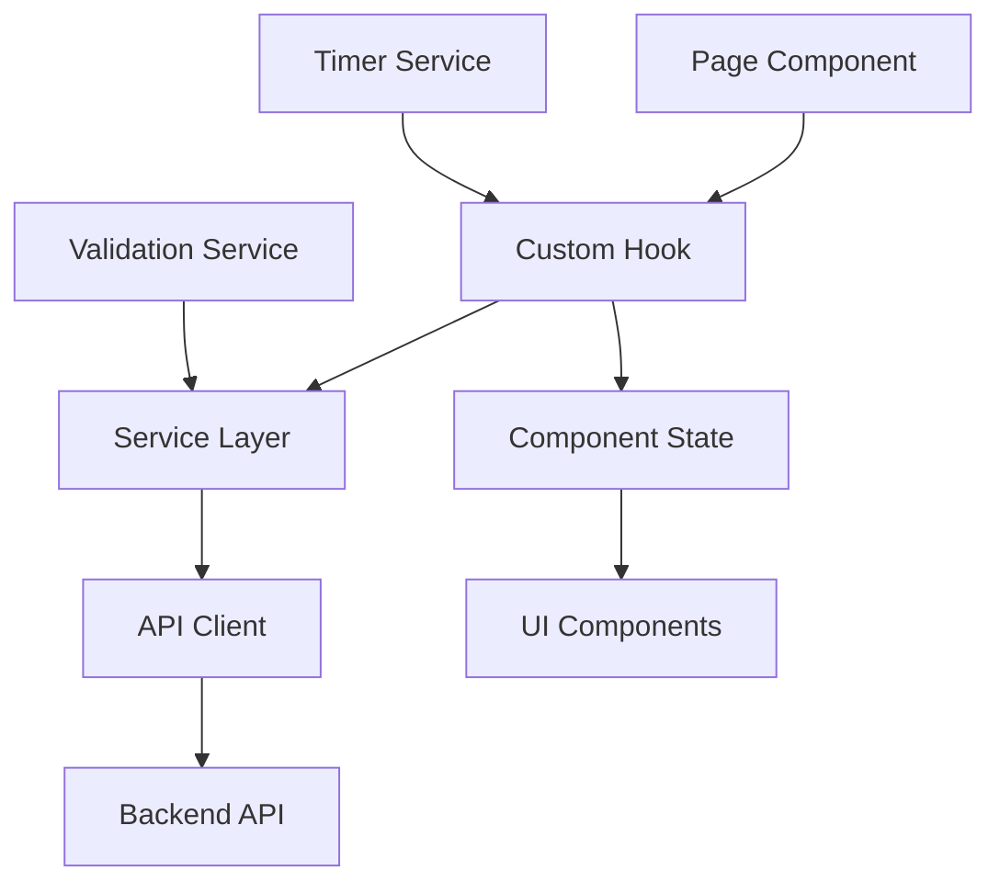

# Practice Module - Refactored Architecture

## Overview

The Practice module has been completely refactored to follow a clean, modular architecture using Next.js 15 + TypeScript best practices. This module manages HSK practice tests for listening and reading comprehension.

## 🏗️ Architecture

### Module Structure

```
src/modules/practice/
├── types/           # TypeScript interfaces and constants
├── services/        # Business logic and data management
├── hooks/          # Custom React hooks
├── components/     # Reusable UI components
└── README.md       # This documentation
```

## 📝 Types (`/types/index.ts`)

### Core Interfaces

```typescript
// Page Component Props
interface PracticePageProps
interface PracticeTypePageProps
interface TestPageProps

// Component Props
interface LevelSelectorProps
interface PracticeCardProps
interface TestContainerProps
interface QuestionNavigationProps

// State Management
interface PracticePageState
interface TestSessionState

// Service Responses
interface PracticeTopicsResponse
interface TestInitResponse
```

### Constants

```typescript
// HSK Level information with styling
export const HSK_LEVELS: HSKLevelInfo[];

// Practice type configurations
export const PRACTICE_TYPE_INFO;
```

## 🔧 Services (`/services/index.ts`)

### PracticeService

Main business logic service for practice operations:

```typescript
// Fetch practice topics by level
PracticeService.fetchPracticeTopics(level: HSKLevel): Promise<PracticeTopicsResponse>

// Initialize a test session
PracticeService.initializeTest(testType: PracticeType, testId: string): Promise<TestInitResponse>

// Calculate test scores
PracticeService.calculateScore(questions: QuizModel[], selectedAnswers: Record<number, number>): TestScore

// Validation helpers
PracticeService.validateQuestions(questions: QuizModel[]): boolean
```

### TimerService

Manages test timing and countdown:

```typescript
TimerService.startTimer(sessionId: string, onTick: (elapsed: number) => void): void
TimerService.stopTimer(sessionId: string): void
TimerService.formatTime(seconds: number): string
```

### ValidationService

Input validation and data integrity:

```typescript
ValidationService.validateTestStart(testId: string, testType: PracticeType)
ValidationService.validateAnswerSelection(answerIndex: number, optionCount: number)
ValidationService.validateHSKLevel(level: string): level is HSKLevel
```

## 🪝 Custom Hooks (`/hooks/`)

### usePracticePage

Manages main practice page state and level selection:

```typescript
const { state, actions } = usePracticePage(initialLevel?: HSKLevel)

// State includes:
// - selectedLevel, practiceTopics, loading, error

// Actions include:
// - setLevel(level), refreshTopics()
```

### useTestSession

Comprehensive test session management:

```typescript
const { state, actions, computed } = useTestSession(testType: PracticeType, testId: string)

// State includes:
// - topic, questions, currentPosition, selectedAnswers, score, etc.

// Actions include:
// - setAnswer, nextQuestion, previousQuestion, completeTest, resetTest

// Computed includes:
// - currentQuestion, progress, navigation flags
```

### Existing Hooks

- `usePracticeTopics` - Fetch topics by type and level
- `useTestLogic` - Legacy test logic (being phased out)

## 🧩 Components (`/components/`)

### Page-Level Components

#### TestContainer

Main test execution component that orchestrates the entire test session:

```typescript
<TestContainer
  testType={PracticeType.LISTENING}
  testId="test-123"
  onBack={() => router.back()}
/>
```

**Features:**

- Handles all test states (loading, error, completed)
- Manages test session with useTestSession hook
- Renders appropriate question content based on test type
- Integrates answer selection and navigation

### Reusable Components

#### LevelSelector

HSK level selection with visual indicators:

```typescript
<LevelSelector
  selectedLevel={HSKLevel.HSK1}
  onLevelChange={(level) => setLevel(level)}
  loading={false}
/>
```

#### PracticeCard

Practice type cards for listening/reading:

```typescript
<PracticeCard
  practiceType={PracticeType.LISTENING}
  topicCount={12}
  selectedLevel={HSKLevel.HSK2}
/>
```

#### PracticePageHeader

Reusable page header component:

```typescript
<PracticePageHeader
  title="HSK Practice Tests"
  description="Practice Chinese HSK tests..."
/>
```

#### QuestionNavigation

Test navigation controls:

```typescript
<QuestionNavigation
  currentPosition={0}
  totalQuestions={10}
  onNext={() => {}}
  onPrevious={() => {}}
  canGoNext={true}
  canGoPrevious={false}
  isLastQuestion={false}
/>
```

### Existing Components

- `LoadingState`, `EmptyState` - State components
- `QuestionHeader`, `ListeningQuestionContent` - Question display
- `AnswerSection` - Answer selection
- `TestResults` - Score display

## 📄 Pages Refactoring

### Main Practice Page (`/app/practice/page.tsx`)

**Before:** 200+ lines with mixed concerns
**After:** Clean, focused component using custom hooks

```typescript
export default function PracticePage() {
  const { state, actions } = usePracticePage();

  return (
    <MainLayout>
      <PracticePageHeader title="..." description="..." />
      <LevelSelector
        selectedLevel={state.selectedLevel}
        onLevelChange={actions.setLevel}
      />
      <PracticeCard
        practiceType={PracticeType.LISTENING}
        topicCount={topics.length}
      />
      <PracticeCard
        practiceType={PracticeType.READING}
        topicCount={topics.length}
      />
    </MainLayout>
  );
}
```

### Test Page (`/app/practice/[type]/test/[id]/page.tsx`)

**Before:** 250+ lines with complex state management
**After:** Minimal orchestration component

```typescript
export default function TestPage() {
  const params = useParams();
  const router = useRouter();

  return (
    <MainLayout>
      <TestContainer
        testType={params.type}
        testId={params.id}
        onBack={() => router.push(`/practice/${params.type}`)}
      />
    </MainLayout>
  );
}
```

## 🎯 Key Benefits

### 1. **Separation of Concerns**

- **Services**: Pure business logic, no UI dependencies
- **Hooks**: State management and side effects
- **Components**: Pure UI rendering with props
- **Pages**: Minimal orchestration

### 2. **Type Safety**

- Comprehensive TypeScript interfaces
- Strict typing throughout the module
- Validation at service boundaries

### 3. **Reusability**

- Components can be used across different pages
- Services can be imported by any component
- Hooks encapsulate reusable logic

### 4. **Testability**

- Services are pure functions, easy to unit test
- Components have clear prop interfaces
- Hooks can be tested in isolation

### 5. **Performance**

- Efficient state management with focused hooks
- Memoized computed values
- Proper timer cleanup

### 6. **Developer Experience**

- Clear file organization
- Self-documenting code structure
- Consistent patterns across the module

## 🔄 Data Flow



## 🚀 Usage Examples

### Starting a Test Session

```typescript
// In a component
const { state, actions, computed } = useTestSession("listening", "test-123");

// Check loading state
if (state.loading) return <LoadingState />;

// Handle current question
const question = computed.currentQuestion;
if (question) {
  // Render question and handle answer
  actions.setAnswer(selectedIndex);
}
```

### Managing Practice Page

```typescript
// In practice page
const { state, actions } = usePracticePage(HSKLevel.HSK1);

// Handle level changes
const handleLevelChange = (level: HSKLevel) => {
  actions.setLevel(level); // Automatically fetches new topics
};

// Access filtered topics
const listeningCount = state.practiceTopics.filter(
  (t) => t.type === "listening"
).length;
```

## 🔧 Configuration

### Environment Variables

```bash
# API configuration
NEXT_PUBLIC_API_URL=https://api.example.com
```

### Timer Configuration

```typescript
// In TimerService
const TIMER_INTERVAL = 1000; // 1 second
const HSK_TIME_LIMITS = {
  "HSK1-3": 1800, // 30 minutes
  "HSK4-6": 2400, // 40 minutes
};
```

## 📈 Performance Optimizations

1. **Memoized Computations**: Progress calculations and question filtering
2. **Efficient State Updates**: Minimal re-renders with focused state slices
3. **Timer Management**: Proper cleanup prevents memory leaks
4. **Service Layer Caching**: Avoid redundant API calls

## 🎨 Styling

- **Tailwind CSS**: Utility-first styling
- **Consistent Design System**: Reusable color and spacing tokens
- **Responsive Design**: Mobile-first approach
- **Accessibility**: Proper ARIA labels and keyboard navigation

## 🔮 Future Enhancements

1. **Reading Question Component**: Complete reading comprehension UI
2. **Test Review Mode**: Allow reviewing completed tests
3. **Progress Tracking**: Save user progress across sessions
4. **Analytics Integration**: Track user performance metrics
5. **Offline Support**: Cache tests for offline practice

## 🐛 Error Handling

- **Service Level**: Comprehensive error catching and logging
- **Component Level**: Graceful error states with retry options
- **Hook Level**: Error state management with user feedback
- **Validation**: Input validation at all boundaries

## 📚 Related Documentation

- [Next.js 15 Documentation](https://nextjs.org/docs)
- [TypeScript Handbook](https://www.typescriptlang.org/docs/)
- [Tailwind CSS](https://tailwindcss.com/docs)
- [React Hooks Guide](https://react.dev/reference/react)

---

This refactored architecture provides a solid foundation for the practice module, making it maintainable, scalable, and developer-friendly while following modern React and Next.js best practices.
